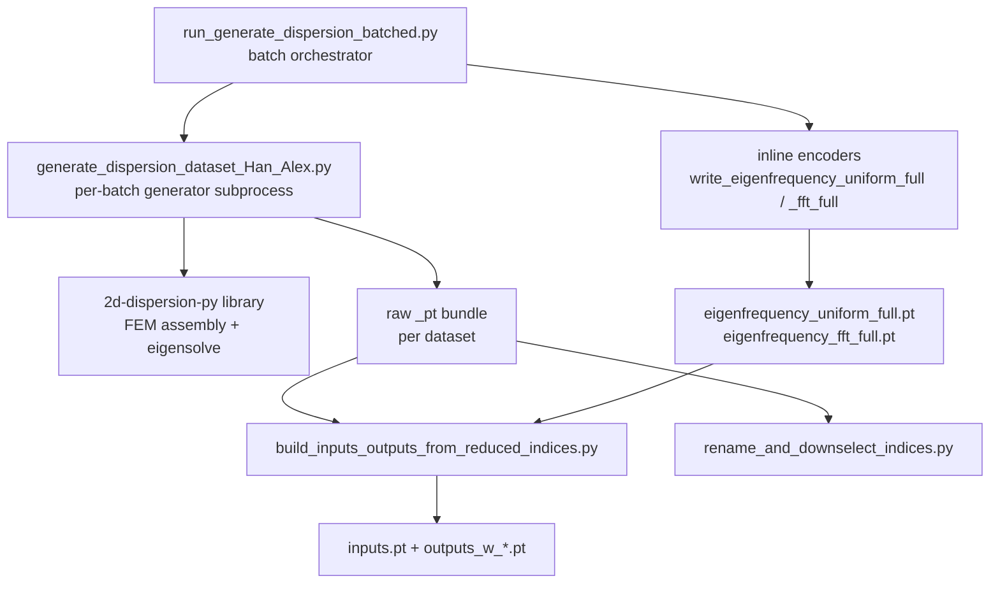

# Data Generation

This document describes how the metamaterial dispersion datasets are generated, from the
batch driver down to the per-dataset tensor bundles consumed by training.

The **main entry point is [`run_generate_dispersion_batched.py`](run_generate_dispersion_batched.py)**.
Everything else in this document is invoked (directly or downstream) from that script or
operates on its outputs.

---

## 1) Generation chain at a glance

| Stage | Script(s) | Produces |
|-------|-----------|----------|
| Orchestration | `run_generate_dispersion_batched.py` | batch loop, manifest, logs, inline encodings |
| Raw generation | `generate_dispersion_dataset_Han_Alex.py` | raw `_pt` bundle per batch |
| FEM/solver core | `2d-dispersion-py/` modules | matrices, eigenpairs (called by generator) |
| Eigenfrequency encoding | inline in driver via `NO_utilities`; bulk backfill via `encode_eigenfrequency_uniform_full.py`, `encode_eigenfrequency_fft_full.py` | `eigenfrequency_uniform_full.pt`, `eigenfrequency_fft_full.pt` |
| Training-tensor assembly | `build_inputs_outputs_from_reduced_indices.py` | `inputs.pt`, `outputs_w_uniform.pt` / `outputs_w_fft.pt` |
| Index downselection | `rename_and_downselect_indices.py` | `indices_full.pt` + downselected `reduced_indices.pt` |
| Histograms | `plot_dataset_histograms.py` | `hist_*.png` |

---

## 2) Main script: `run_generate_dispersion_batched.py`

A batch driver that repeatedly launches the heavy generator as subprocesses with
deterministic seed offsets, then post-processes each batch into encoded eigenfrequency
tensors.

### Key CLI arguments

| Argument | Default | Meaning |
|----------|---------|---------|
| `--total-samples` | 24000 | Total structures to generate (must be divisible by `--batch-size`). |
| `--batch-size` | 1000 | Structures per batch (= number of generator subprocess launches). |
| `--start-seed-offset` | 0 | Seed offset for the first training batch. |
| `--run-validation` | off | Generate a validation batch after all training batches succeed. |
| `--validation-size` | 1000 | Validation structures. |
| `--validation-seed-offset` | 24000 | Seed offset for the validation batch (disjoint from training). |
| `--binarize` | off | Generate binarized (0/1) designs instead of continuous. |
| `--parallel-workers` | 16 | Worker processes forwarded to the generator. |
| `--skip-uniform-encoding` / `--skip-fft-encoding` | off | Disable the respective inline encoder. |
| `--uniform-patch-size`, `--fft-wavelet-size` | 32 | Patch side length for encodings. |

### Flow

1. Validate `total_samples % batch_size == 0`; create `OUTPUT/batched_generation_<timestamp>/` and an in-memory `manifest`.
2. For each batch `i`: `seed_offset = start_seed_offset + i * batch_size`.
3. Launch `generate_dispersion_dataset_Han_Alex.py` as a subprocess (`--skip-demo`, optional `--binarize`), logging to `logs/train_batch_<i>.log`, and parse stdout for the `SUCCESS: PyTorch dataset bundle saved to: ...` path.
4. On success, run the inline encoders against that bundle's `eigenvalue_data_full.pt`:
   - `write_eigenfrequency_uniform_full` → `eigenfrequency_uniform_full.pt` (+ histogram).
   - `write_eigenfrequency_fft_full` → `eigenfrequency_fft_full.pt` (+ histogram + decode round-trip spot-check).
5. Append per-batch status to the manifest; **stop the loop at the first non-zero exit code**.
6. Optionally run the validation batch (only if all training batches succeeded), with the same encodings.
7. Write `manifest.json` and a summary.

### Inline encoders (defined in the driver)

- `write_eigenfrequency_uniform_full` clamps non-positive eigenvalues to float16 `1e-6` then calls `NO_utilities.encode_eigenfrequency_uniform_torch` → uniform 32×32 patches of `ln(s)/100`.
- `write_eigenfrequency_fft_full` encodes **unique** eigenvalues via `NO_utilities.embed_eigenfrequency_wavelet` and scatters them back to full shape (dedup for speed), then verifies a few entries with `extract_eigenfrequency_from_wavelet`.

---

## 3) Per-batch generator: `generate_dispersion_dataset_Han_Alex.py`

Generates `--n-struct` designs, solves dispersion, and writes the raw `_pt` bundle.

- Prepends `2d-dispersion-py/` to `sys.path` and imports the FEM/design utilities.
- Fixed physics/discretization contract: `N_ele=1`, `N_pix=32`, `N_wv=[25,13]` (→ **325** wavevectors), `N_eig=6` bands, vectorized assembly (`isUseImprovement=True`), `isSaveEigenvectors=True`.
- Per structure: design synthesis (`get_design2` → `get_prop` → `kernel_prop`, `p4mm` symmetry) → material mapping (`apply_steel_rubber_paradigm`, optional `--binarize`) → `dispersion_with_matrix_save_opt` (assemble `K`,`M`; per-wavevector reduced eigensolve; `f = sqrt(max(real(λ),0))/(2π)`).
- A shared transformation-matrix cache `precomputed_T_matrices.pkl` (repo root) is reused across structures/batches with the same wavevector grid.
- Determinism: `design_number = struct_idx + rng_seed_offset`, giving non-overlapping seed windows across batches.

### Core solver modules traversed (`2d-dispersion-py/`)

`dispersion_with_matrix_save_opt.py`, `system_matrices_vec.py`, `system_matrices.py`,
`elements_vec.py`, `design_parameters.py`, `get_design2.py`, `get_prop.py`, `kernels.py`,
`symmetry.py`, `wavevectors.py`, `design_conversion.py`, `utils.py`, plus `NO_utilities.py`
for the wavelet embeddings used when building the `_pt` bundle.

---

## 4) Outputs and shapes

Let `N_struct` = designs in the dataset, `N_wv = 325`, `N_band = 6`, `N_pix = 32`.
Per-sample row count `n = N_struct × N_wv × N_band` (full cartesian, before any downselection).

### 4.1 Raw `_pt` bundle (written by the generator)

Location: `OUTPUT/output_<timestamp>/<continuous|binarized>_<timestamp>_pt/`

| File | Shape | Dtype | Notes |
|------|-------|-------|-------|
| `geometries_full.pt` | `(N_struct, 32, 32)` | float16 | First design channel (geometry image). |
| `waveforms_full.pt` | `(N_wv, 32, 32)` | float16 | Per-wavevector wavelet embedding (input ch1). |
| `band_fft_full.pt` | `(N_band, 32, 32)` | float16 | Per-band integer-wavelet embedding (input ch2). |
| `wavevectors_full.pt` | `(N_struct, N_wv, 2)` | float16 | Raw `(kx, ky)` coordinates. |
| `eigenvalue_data_full.pt` | `(N_struct, N_wv, N_band)` | float16 | Eigenfrequencies per design/wavevector/band. |
| `displacements_dataset.pt` | `TensorDataset` of 4 × `(n, 32, 32)` or `(N_struct·N_wv·N_band, 32, 32)` | float16 | Channels: x_real, x_imag, y_real, y_imag. |
| `reduced_indices.pt` | list of `(design_idx, wavevector_idx, band_idx)`, length `n` | int | Sample-to-source map. |
| `design_params_full.pt` | `(N_struct, 1)` | — | Design parameter handles. |

### 4.2 Encoded eigenfrequency tensors (inline in driver; or bulk backfill)

| File | Shape | Dtype | Producer |
|------|-------|-------|----------|
| `eigenfrequency_uniform_full.pt` | `(N_struct, N_wv, N_band, 32, 32)` | float16 | `write_eigenfrequency_uniform_full` / `encode_eigenfrequency_uniform_full.py` |
| `eigenfrequency_fft_full.pt` | `(N_struct, N_wv, N_band, 32, 32)` | float16 | `write_eigenfrequency_fft_full` / `encode_eigenfrequency_fft_full.py` |

Each eigenfrequency scalar is expanded to a 32×32 image patch (uniform `ln(s)/100`, or wavelet-encoded).

### 4.3 Training tensors (`build_inputs_outputs_from_reduced_indices.py`)

Gathers per-sample slices indexed by `reduced_indices.pt`, in chunks:

| File | Shape | Dtype | Channels |
|------|-------|-------|----------|
| `inputs.pt` | `(n, 3, 32, 32)` | float16 | ch0 `geometries_full[d]`, ch1 `waveforms_full[w]`, ch2 `band_fft_full[b]` |
| `outputs_w_uniform.pt` / `outputs_w_fft.pt` | `(n, 5, 32, 32)` | float16 | ch0 `eigenfrequency_*_full[d,w,b]`, ch1–4 displacements (x_real, x_imag, y_real, y_imag) |

The `--eigen-ch0-encoding {uniform,fft}` flag selects which eigenfrequency tensor fills channel 0 and the corresponding stacked-output filename.

### 4.4 Index downselection (`rename_and_downselect_indices.py`)

Renames the original `reduced_indices.pt` → `indices_full.pt`, then writes a new
downselected `reduced_indices.pt` keeping `max(1, N_wv // 5)` randomly chosen wavevectors
per `(design, band)` (seed `20260309`). This reduces the effective `n` used by training.

### 4.5 Batch-run artifacts (driver)

Location: `OUTPUT/batched_generation_<timestamp>/`

| File | Contents |
|------|----------|
| `manifest.json` | Run params + per-batch status (`batch_idx`, `seed_offset`, `exit_code`, output paths, log path); optional `validation_batch`. |
| `logs/train_batch_<NNN>.log`, `logs/validation_batch.log` | Full subprocess stdout/stderr per batch. |

---

## 5) Notes

- The generator writes under `OUTPUT/`; training reads named datasets (`c_train_*`, `b_train_*`, `c_test`, `b_test`) under `DATASETS/`. An organizing/rename step between the two is not part of this chain.
- `train_from_disk.py` does **not** require `outputs_w_*.pt`: it reads `inputs.pt`, takes displacement channels 1–4 from `outputs.pt`, and builds channel 0 on the fly from `eigenfrequency_*_full.pt` at `reduced_indices`. The `outputs_w_*.pt` files are a precomputed stacked-target alternative. See [ML_TRAINING.md](ML_TRAINING.md).
- `.mat` export is intentionally disabled in the current generator; the pipeline is `.pt`-first.
