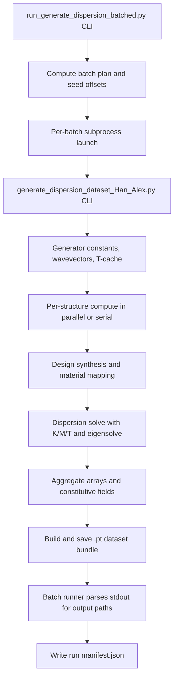

# Data Generation Workflow

## Purpose

This document defines the standard batched data-generation workflow driven by `run_generate_dispersion_batched.py` and the downstream generator `generate_dispersion_dataset_Han_Alex.py`.

It is the single source of truth for:
- Batch orchestration, seed scheduling, and manifest logging.
- Nested call flow from CLI entry points to low-level eigensolve and matrix assembly.
- Output artifact structure (`.pt` bundles, logs, manifest, optional `.pkl`).
- Failure handling and reproducibility knobs.

---

## 1) Top-Level Workflow

---

## 2) Entry Point: Batched Orchestrator

## 2.1 Script and intent

- Driver: `run_generate_dispersion_batched.py`
- Responsibility:
  - Split a large sample target into fixed-size batches.
  - Launch one generator subprocess per batch with deterministic seed offsets.
  - Capture per-batch logs and summarize outputs in a run manifest.

## 2.2 CLI contract

Primary arguments:
- `--repo-root`: repository root used for subprocess `cwd`.
- `--total-samples`: total train samples to generate.
- `--batch-size`: per-batch structure count.
- `--start-seed-offset`: seed offset for batch 0.
- `--run-validation`: optional post-train validation batch.
- `--validation-size`, `--validation-seed-offset`: validation controls.
- `--binarize`: forwarded to generator.
- `--parallel-workers`: forwarded to generator.

Guardrail:
- `total_samples % batch_size == 0` is required; otherwise script raises `ValueError`.

## 2.3 Run directory and manifest skeleton

For each orchestrator invocation:
- Creates run root: `OUTPUT/batched_generation_<timestamp>/`
- Initializes `manifest` with:
  - run metadata (`run_root`, `repo_root`, sizes, seed offsets, flags)
  - `train_batches` list
  - optional `validation_batch`

## 2.4 Per-batch subprocess launch (`_run_one_batch`)

Each batch launch:
1. Builds command:
   - `python generate_dispersion_dataset_Han_Alex.py`
   - `--n-struct <batch_size>`
   - `--rng-seed-offset <computed_offset>`
   - `--parallel-workers <N>`
   - `--skip-demo`
   - optional `--binarize`
2. Runs subprocess with `stdout`+`stderr` merged.
3. Writes full subprocess output to:
   - `OUTPUT/batched_generation_<ts>/logs/train_batch_<idx>.log`
4. Parses stdout for:
   - `SUCCESS: PyTorch dataset bundle saved to: ...`
   - `SUCCESS: Python pickle file saved to: ...`
5. Returns structured status:
   - exit code, batch index, seed offset, output paths, log path.

Failure behavior:
- First failed train batch stops further train batches.
- Validation runs only if all train batches succeeded.

## 2.5 Final summary output

At end of run:
- Writes `manifest.json` under run root.
- Prints summary counts and manifest path JSON snippet.

---

## 3) Subprocess Generator: Main Responsibilities

## 3.1 Script and entry point

- Worker script: `generate_dispersion_dataset_Han_Alex.py`
- Main callable: `generate_dispersion_dataset_with_matrices(...)`
- Default mode from batched runner:
  - no demo (`--skip-demo`)
  - no `.pkl` unless explicitly requested
  - `.pt` bundle output enabled

## 3.2 Internal CLI

Accepted flags:
- `--n-struct`
- `--rng-seed-offset`
- `--binarize`
- `--parallel-workers`
- `--save-pkl`
- `--run-demo` (not used in batched flow)
- `--skip-demo` (compatibility no-op to suppress demo path)

## 3.3 Library imports and runtime pathing

The generator prepends `2d-dispersion-py` to `sys.path` and imports:
- `dispersion_with_matrix_save_opt`
- `get_design`, `get_design2`
- `get_IBZ_wavevectors`
- `DesignParameters`
- `convert_design`, `design_to_explicit`, `apply_steel_rubber_paradigm`
- `get_transformation_matrix`
- `validate_constants`, `check_contour_analysis`

If imports fail, script exits immediately.

---

## 4) Generator Setup Phase (Before Structure Loop)

## 4.1 Constants and discretization

The generator defines the physical/discretization contract:
- `N_ele = 1`
- `N_pix = 32`
- `N_wv = [25, 13]`
- `N_eig = 6`
- `a = 1.0`
- `sigma_eig = 1e-2`
- design scale: `linear`
- material bounds: `E`, `rho`, `poisson`, `t`

Compute flags:
- `isUseImprovement=True` (vectorized assembly path)
- `isUseSecondImprovement=False` (simplified vectorized path off)
- `isUseParallel = (parallel_workers > 1)` for outer structure loop only
- `isSaveEigenvectors=True`

## 4.2 Wavevector generation

Call:
- `get_IBZ_wavevectors(N_wv=[25,13], a=1.0, symmetry_type='none')`

Effect:
- Builds asymmetric IBZ grid in `(kx, ky)` and stores as float16 in `const['wavevectors']`.

## 4.3 Precomputed transformation matrix cache (T-cache)

Path:
- `precomputed_T_matrices.pkl` at repository root.

Flow:
1. Compute signature from lattice parameters + wavevector bytes hash.
2. Load cache object if present.
3. If signature missing, compute:
   - `get_transformation_matrix(wv, const)` for each wavevector.
4. Persist entry and attach:
   - `precomputed_wavevectors`
   - `precomputed_T_data`

This reduces repeated T construction across structures and across batched runs with the same grid/signature.

## 4.4 Design parameter object init

Creates `DesignParameters(N_struct)` and sets:
- coupled property mode
- kernel design style
- periodic kernel options
- p4mm symmetry
- `N_pix=[32,32]`

Then calls `prepare()`:
- expands scalar fields to 3-property lists via `expand_property_information()`.

## 4.5 Storage allocation

Preallocates:
- `designs`: `(32, 32, 3, N_struct)` float16
- `wavevector_data`: `(N_wv_total, 2, N_struct)` float16
- `eigenvalue_data`: `(N_wv_total, N_eig, N_struct)` float16
- `eigenvector_data`: `(N_dof, N_wv_total, N_eig, N_struct)` complex64
- constitutive arrays (`E`, `rho`, `nu`) in float32
- per-structure `K_data`, `M_data`, `T_data` lists

Validation:
- `validate_constants(const)` enforces required fields before compute.

---

## 5) Per-Structure Compute Flow (`_compute_single_structure`)

Each structure is computed independently, either:
- in `ProcessPoolExecutor` workers, or
- serially in-process.

For structure index `i`:
- `design_number = i + rng_seed_offset`

## 5.1 Local const and optional T-cache attach

Worker creates local const copy and, if cache path is set:
- resolves cache entry
- injects `precomputed_wavevectors` and `precomputed_T_data`.

## 5.2 Design synthesis pipeline

Nested calls:
1. `DesignParameters(1)` with same options and `design_number`.
2. `prepare()` -> `expand_property_information()`.
3. `get_design2(design_params)`:
   - loops `prop_idx=1..3`
   - calls `get_prop(design_parameters, prop_idx)`.
4. `get_prop(...)`:
   - branch on `design_style` (here `kernel`)
   - for `kernel`: call `kernel_prop(...)`.
5. `kernel_prop(...)`:
   - constructs covariance (periodic kernel in this workflow)
   - samples multivariate Gaussian field
   - clips to `[0,1]`
6. `get_prop(...)` post-processing:
   - applies symmetry (`p4mm` -> `symmetry.apply_p4mm_symmetry`)
   - optional discretization by `N_value` (here `inf`, so no quantization).
7. `convert_design(... linear -> const['design_scale'])`
8. `apply_steel_rubber_paradigm(design, const)` channel-wise remapping.
9. Optional binarization:
   - `np.round(design)` if `--binarize`.

## 5.3 Dispersion and eigensolve pipeline

Call:
- `dispersion_with_matrix_save_opt(const_local, const_local['wavevectors'])`

Nested steps inside:
1. Build global matrices:
   - `get_system_matrices_VEC(const)` because `isUseImprovement=True`.
2. `get_system_matrices_VEC`:
   - expands pixel design to element resolution
   - maps design channels to explicit `E`, `nu`, `rho`
   - calls:
     - `get_element_stiffness_VEC(...)`
     - `get_element_mass_VEC(...)`
   - assembles sparse global `K`, `M`.
3. For each wavevector:
   - uses precomputed `T` when available; otherwise `get_transformation_matrix(...)`.
   - computes reduced operators:
     - `Kr = T^H K T`
     - `Mr = T^H M T`
   - eigensolve path:
     - dense solve for smaller systems / specific sigma mode
     - sparse `scipy.sparse.linalg.eigs` otherwise
   - sorts eigenpairs
   - normalizes/phase-aligns eigenvectors (if enabled)
   - converts eigenvalues to frequencies:
     - `sqrt(max(real(lambda),0)) / (2*pi)`
4. Returns:
   - wavevectors, frequencies, eigenvectors, mesh (usually None), and optionally `K`,`M`,`T`.

Failure detail:
- Eigensolve exceptions are wrapped as structured `EIGENSOLVE_DIAG ...` JSON to preserve k-index, wavevector, matrix metadata, and solver mode.

## 5.4 Explicit property expansion for outputs

After solve:
- `design_to_explicit(...)` computes physical `E/rho/nu` maps.

Worker returns packed structure payload (or structured error payload).

---

## 6) Structure Aggregation and Progress

Parent process aggregates each successful structure into global arrays/lists:
- design tensor
- wavevectors
- frequencies
- eigenvectors
- constitutive maps
- K/M/T per structure

Also:
- checks frequency imaginary component against tolerance
- prints periodic progress with elapsed/rate/ETA
- emits structured error events for failed structures

---

## 7) Output Serialization Pipeline

## 7.1 Dataset object assembly

Builds in-memory dataset dictionary with MATLAB-style keys and metadata:
- `WAVEVECTOR_DATA`, `EIGENVALUE_DATA`, optional `EIGENVECTOR_DATA`
- `CONSTITUTIVE_DATA`
- `designs`, `const`, `design_params`, `design_numbers`
- optional `K_DATA`, `M_DATA`, `T_DATA`

Note:
- Legacy `.mat` export path is intentionally disabled in this script.

## 7.2 PyTorch bundle conversion (`_build_pt_dataset_outputs`)

Transforms internal arrays to `.pt`-friendly artifacts:
- `geometries_full`: from first design channel, shape `(N_struct, 32, 32)`
- `wavevectors_full`: shape `(N_struct, N_wv, 2)`
- `eigenvalue_data_full`: shape `(N_struct, N_wv, N_eig)`
- eigenvectors split into x/y real/imag channels for `displacements_dataset` tensor dataset
- `reduced_indices`: full cartesian list `(design_idx, wavevector_idx, band_idx)`
- optional wavelet embeddings:
  - tries `NO_utilities.embed_2const_wavelet`
  - falls back to zero placeholders if unavailable
- `design_params_full`: shape `(N_struct, 1)`

## 7.3 Files written per generator run

Under:
- `OUTPUT/output_<timestamp>/`

Writes:
- script snapshot copy
- subfolder `<design_type>_<timestamp>_pt/` containing:
  - `displacements_dataset.pt`
  - `reduced_indices.pt`
  - `geometries_full.pt`
  - `waveforms_full.pt`
  - `wavevectors_full.pt`
  - `band_fft_full.pt`
  - `design_params_full.pt`
  - `eigenvalue_data_full.pt`
- optional `<design_type>_<timestamp>.pkl` when `--save-pkl` is set.

Console markers used by batched runner parser:
- `SUCCESS: PyTorch dataset bundle saved to: ...`
- `SUCCESS: Python pickle file saved to: ...`

---

## 8) Batched Run Artifacts and Folder Layout

For one orchestrator invocation:
- Run root: `OUTPUT/batched_generation_<timestamp>/`
- Logs:
  - `logs/train_batch_000.log`, ...
  - optional `logs/validation_batch.log`
- Manifest:
  - `manifest.json` with per-batch status, output paths, exit codes.

Each successful batch typically points to one generator output folder:
- `OUTPUT/output_<timestamp>/<continuous|binarized>_<timestamp>_pt/`

---

## 9) Reproducibility and Determinism Controls

Primary deterministic control:
- `design_number = struct_idx + rng_seed_offset`
- Batched runner computes non-overlapping offsets by:
  - `start_seed_offset + batch_idx * batch_size`

Implications:
- No overlap between train batches when offsets are configured as above.
- Validation can be forced disjoint with `--validation-seed-offset`.

Additional controls:
- fixed discretization/material constants in generator
- optional env toggles inside eigensolver path (parity/debug flags).

---

## 10) Failure Semantics and Recovery Strategy

## 10.1 Per-structure failures inside generator

- Captured and returned as structured error dicts.
- Generation continues for other structures in same batch.
- Errors logged with traceback and structured diagnostics.

## 10.2 Batch-level failures in orchestrator

- Non-zero subprocess exit code marks batch failure.
- Train loop stops at first failed batch.
- Validation batch skipped unless all train batches succeeded.

## 10.3 Recovery pattern

1. Inspect failed batch log file from manifest.
2. Re-run just the failed seed range by launching generator directly with:
   - matching `--n-struct`
   - matching `--rng-seed-offset`
   - matching `--parallel-workers`
   - matching `--binarize` state.

---

## 11) Operational Notes

- `run_generate_dispersion_batched.py` always forwards `--skip-demo`; plotting demo path is excluded from production batch generation.
- T-cache (`precomputed_T_matrices.pkl`) is shared across runs and can significantly reduce repeated transformation setup cost.
- Constitutive arrays are float32 by design to avoid overflow at high modulus bounds.
- The workflow currently prioritizes `.pt` production; `.mat` persistence is intentionally disabled in the generator.

