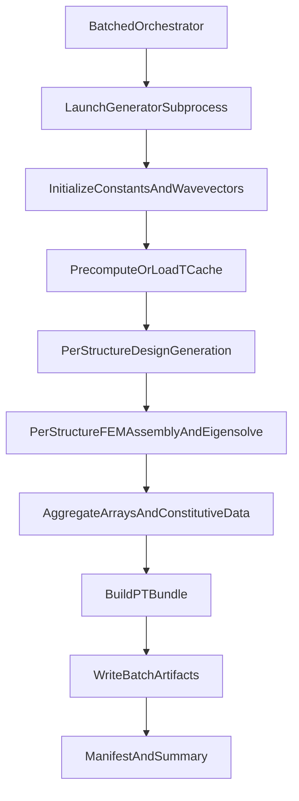

# Dispersion Data Generation Workflow

## Purpose

This document defines the detailed, implementation-level workflow for batched dispersion dataset generation driven by `run_generate_dispersion_batched.py`.

It is the single source of truth for:
- Batch orchestration semantics (seed-offset scheduling, logging, manifests).
- Nested execution flow into `generate_dispersion_dataset_Han_Alex.py`.
- Downstream call graph into the `2d-dispersion-py` FEM/dispersion library.
- Output artifacts and their structure for training/validation handoff.

---

## 1) Entry Point and Scope

### 1.1 Primary orchestrator

- File: `run_generate_dispersion_batched.py`
- Role: repeatedly launches `generate_dispersion_dataset_Han_Alex.py` as subprocess jobs with deterministic seed offsets.

### 1.2 Generator process invoked per batch

- File: `generate_dispersion_dataset_Han_Alex.py`
- Role: generates `N_struct` designs, solves dispersion/eigenvectors, and exports `.pt` bundles.

### 1.3 Core solver modules traversed

The generator imports and executes functions from:
- `2d-dispersion-py/dispersion_with_matrix_save_opt.py`
- `2d-dispersion-py/system_matrices_vec.py`
- `2d-dispersion-py/system_matrices.py`
- `2d-dispersion-py/elements_vec.py`
- `2d-dispersion-py/design_parameters.py`
- `2d-dispersion-py/get_design2.py`
- `2d-dispersion-py/get_prop.py`
- `2d-dispersion-py/kernels.py`
- `2d-dispersion-py/symmetry.py`
- `2d-dispersion-py/wavevectors.py`
- `2d-dispersion-py/design_conversion.py`
- `2d-dispersion-py/utils.py`
- `NO_utilities.py` (for wavelet embeddings in `.pt` export)

---

## 2) Batch Orchestrator (`run_generate_dispersion_batched.py`)

## 2.1 CLI contract

Key arguments:
- `--total-samples` (default `24000`)
- `--batch-size` (default `1000`)
- `--start-seed-offset` (default `0`)
- `--run-validation` (optional)
- `--validation-size` (default `1000`)
- `--validation-seed-offset` (default `24000`)
- `--binarize` (optional)
- `--parallel-workers` (default `16`)
- `--repo-root` (defaults to current script directory)

Guard:
- `total_samples % batch_size == 0` is enforced; otherwise run fails immediately.

### 2.2 Run root and log layout

For each orchestrator invocation:
- Creates `OUTPUT/batched_generation_<timestamp>/`
- Creates per-batch logs under `.../logs/`
- Writes `manifest.json` summarizing all train/validation batch outcomes

### 2.3 Per-batch subprocess invocation

For each train batch index `i`:
- Computes `seed_offset = start_seed_offset + i * batch_size`
- Runs:
  - `python generate_dispersion_dataset_Han_Alex.py --n-struct <batch_size> --rng-seed-offset <seed_offset> --parallel-workers <parallel_workers> --skip-demo [--binarize]`
- Captures stdout/stderr into `train_batch_<i>.log`
- Parses stdout for:
  - `SUCCESS: PyTorch dataset bundle saved to: ...`
  - `SUCCESS: Python pickle file saved to: ...`

Stop policy:
- If any train batch exits non-zero, orchestration stops early and does not continue remaining train batches.

### 2.4 Optional validation batch

Validation batch is launched only if:
- `--run-validation` is set, and
- all train batches completed with `exit_code == 0`.

Validation call reuses same generator path and options with independent `validation_size` and `validation_seed_offset`.

### 2.5 Manifest schema

`manifest.json` includes:
- global run metadata (`run_root`, `repo_root`, `batch_size`, seeds, `binarize`, `parallel_workers`)
- `train_batches[]` (each with `batch_idx`, `seed_offset`, `exit_code`, output paths, log path)
- `validation_batch` (same shape, if requested)

---

## 3) High-Level Runtime Pipeline

---

## 4) Generator Main Flow (`generate_dispersion_dataset_Han_Alex.py`)

## 4.1 Argument and run-state setup

Generator arguments:
- `--n-struct`
- `--rng-seed-offset`
- `--binarize`
- `--parallel-workers`
- `--save-pkl`
- `--run-demo` (not used by orchestrator because `--skip-demo` is passed)

Initial runtime actions:
- Inserts `2d-dispersion-py` into `sys.path`
- Imports solver/design utilities
- Emits structured `LOG_EVENT` JSON for run-start metadata

### 4.2 Constants and physical defaults

Core constants prepared in `const`:
- grid/discretization: `N_ele=1`, `N_pix=32`, `N_wv=[25,13]`, `N_eig=6`
- solver controls: `sigma_eig=1e-2`, `design_scale='linear'`
- material ranges:
  - `E_min=200e6`, `E_max=200e9`
  - `rho_min=8e2`, `rho_max=8e3`
  - `poisson_min=0.0`, `poisson_max=0.5`
  - `t=1.0`
- implementation flags:
  - `isUseImprovement=True` (vectorized FEM assembly)
  - `isUseSecondImprovement=False`
  - `isSaveEigenvectors=True`
  - `isUseParallel=(parallel_workers > 1)`

### 4.3 Wavevector grid creation

Calls:
- `wavevectors.get_IBZ_wavevectors(N_wv, a, 'none')`

Behavior:
- Creates rectangular/asymmetric IBZ grid for `'none'` symmetry.
- For `[25,13]`, total wavevectors = `25 * 13 = 325`.

### 4.4 Precomputed transformation matrix cache (`T` cache)

Path:
- `precomputed_T_matrices.pkl` in repo root.

Flow:
1. Build cache signature from `(N_ele, N_pix, a, wavevector bytes hash)`.
2. Load existing cache object if present.
3. If entry missing, compute `T` for every wavevector via:
   - `system_matrices.get_transformation_matrix(wv, const)`
4. Persist cache entry for future batches.

Effect:
- Avoids recomputing Bloch transformation matrices for every structure when wavevector grid is unchanged.

---

## 5) Per-Structure Nested Pipeline

Each structure is processed by `_compute_single_structure(...)` in either:
- process pool mode (`ProcessPoolExecutor`) or
- serial loop fallback.

### 5.1 Design parameter expansion

Per structure:
1. Compute deterministic `design_number = struct_idx + rng_seed_offset`.
2. Build `DesignParameters(1)` object.
3. Set:
   - `property_coupling='coupled'`
   - `design_style='kernel'`
   - `design_options.kernel='periodic'`, with `sigma_f=1.0`, `sigma_l=1.0`, `symmetry_type='p4mm'`, `N_value=inf`
   - `N_pix=[32, 32]`
4. Call `DesignParameters.prepare()`, which expands scalar config to 3 property channels.

### 5.2 Property field generation

Call chain:
1. `get_design2(design_params)` loops `prop_idx=1..3`.
2. For each channel, `get_prop(design_params, prop_idx)`:
   - uses `design_style='kernel'` path
   - calls `kernels.kernel_prop('periodic', ...)`
   - samples a Gaussian random field from kernel covariance
   - applies clipping `[0,1]`
   - applies symmetry `symmetry.apply_p4mm_symmetry(...)`

Output:
- 3-channel normalized design array `(32, 32, 3)`.

### 5.3 Design-to-material mapping

Transform sequence:
1. `design_conversion.convert_design(..., 'linear' -> const['design_scale'])`
2. `design_conversion.apply_steel_rubber_paradigm(design, const)` remaps channels to steel/polymer-inspired parameterized bands.
3. Optional binarization: `np.round(design)` when `--binarize` set.

Then:
- `const_local['design'] = design_f16`

### 5.4 Dispersion solve with matrix capture

Main solver call:
- `dispersion_with_matrix_save_opt(const_local, wavevectors)`

Returned:
- `wv` (wavevectors)
- `fr` (frequencies per wavevector/band)
- `ev` (eigenvectors)
- `K`, `M`, `T` (global K/M and per-wavevector transforms)

### 5.5 Nested solver internals (`dispersion_with_matrix_save_opt`)

1. Chooses assembly path:
   - default `get_system_matrices_VEC(const)` from `system_matrices_vec.py`
2. In `get_system_matrices_VEC`:
   - element-wise material property expansion from design
   - vectorized element stiffness/mass computation using:
     - `elements_vec.get_element_stiffness_VEC`
     - `elements_vec.get_element_mass_VEC`
   - sparse global assembly into CSR matrices `K`, `M`
3. For each wavevector `k`:
   - obtains `T` (from precomputed map when available, else computes)
   - forms reduced operators:
     - `Kr = T^H K T`
     - `Mr = T^H M T`
   - solves generalized EVP:
     - dense route for small/relevant cases, sparse `scipy.sparse.linalg.eigs` otherwise
   - sorts eigenpairs
   - phase-aligns and normalizes eigenvectors
   - computes frequency:
     - `f = sqrt(max(real(lambda), 0)) / (2*pi)`
4. Returns `fr`, `ev`, and optional matrix outputs.

### 5.6 Constitutive explicit expansion for outputs

After solve, generator also calls:
- `design_conversion.design_to_explicit(...)`

This materializes `E`, `rho`, `nu` maps per structure for constitutive reporting/output storage.

### 5.7 Error handling per structure

If any step fails:
- returns structured error payload (`ok=False`, traceback, optional eigensolve diagnostics).
- parent loop logs `LOG_EVENT structure_failure`.
- run continues processing other structures (unless subprocess-level failure propagates later).

---

## 6) Batch Aggregation and Output Packaging

## 6.1 In-memory aggregate arrays

As structures complete, generator fills:
- `designs`: `(32,32,3,N_struct)` float16
- `wavevector_data`: `(325,2,N_struct)` float16
- `eigenvalue_data`: `(325,6,N_struct)` float16
- `eigenvector_data`: `(N_dof,325,6,N_struct)` complex64 where `N_dof = 2*(N_pix*N_ele)^2`
- constitutive maps (`modulus`, `density`, `poisson`) as float32
- lists `K_DATA`, `M_DATA`, `T_DATA`

### 6.2 PT bundle construction (`_build_pt_dataset_outputs`)

Transforms aggregate data into training-compatible tensors:

1. `designs -> geometries_full`
   - uses first channel only
   - shape `(N_struct, 32, 32)`

2. `wavevector_data -> wavevectors_full`
   - shape `(N_struct, 325, 2)`

3. eigenvector reshaping
   - interleaved DOF -> x/y component images
   - builds flattened sample tuples `(design_idx, wavevector_idx, band_idx)` as `reduced_indices`

4. creates `displacements_dataset` as TensorDataset with:
   - x_real, x_imag, y_real, y_imag

5. builds embeddings via `NO_utilities`:
   - `embed_2const_wavelet(...)` -> `waveforms_full`
   - `embed_integer_wavelet(...)` -> `band_fft_full`
   - if unavailable, falls back to zero placeholders

6. writes `design_params_full` and `eigenvalue_data_full`

### 6.3 Files written per generator invocation

Under:
- `OUTPUT/output_<timestamp>/<design_type>_<timestamp>_pt/`

Writes:
- `displacements_dataset.pt`
- `reduced_indices.pt`
- `geometries_full.pt`
- `waveforms_full.pt`
- `wavevectors_full.pt`
- `band_fft_full.pt`
- `design_params_full.pt`
- `eigenvalue_data_full.pt`

Optional:
- full `.pkl` dataset snapshot when `--save-pkl` enabled.

---

## 7) End-to-End Artifact Semantics in Batched Mode

For each orchestrator batch:
- one generator subprocess produces one timestamped `_pt` output directory.
- orchestrator records that path in `manifest.json` under `train_batches[i].output_pt_path`.

This means a full run yields:
- many independent `_pt` directories (one per batch), plus logs and manifest.

Downstream consumers should treat `manifest.json` as the authoritative index of batch outputs.

---

## 8) Determinism and Data Partitioning Behavior

### 8.1 Seed scheduling

Within a batch:
- structure seed = `rng_seed_offset + struct_idx`

Across batches:
- offsets jump by `batch_size`, creating non-overlapping deterministic seed windows.

### 8.2 Train/validation split convention

Typical orchestrator defaults:
- training seed range starts at `0`
- validation seed range starts at `24000`

This enforces deterministic, non-overlapping design-number spaces when using defaults.

---

## 9) Performance and Failure Characteristics

### 9.1 Parallelism layers

- Orchestrator runs batches sequentially.
- Inside each generator subprocess, structures are solved in parallel workers (`ProcessPoolExecutor`) when `parallel_workers > 1`.

### 9.2 Cached vs uncached hot path

- First run for a wavevector signature builds `precomputed_T_matrices.pkl`.
- Subsequent runs reuse cached `T` and avoid repeated transform construction costs.

### 9.3 Failure modes

- Structure-level failures are logged and skipped inside a batch.
- Subprocess non-zero exit marks batch failure in orchestrator and halts further train batches.
- Manifest and logs preserve traceability to exact failed batch/seed window.

---

## 10) Operational Checklist

Before launching batched generation:
- Confirm `2d-dispersion-py` import path resolves from `generate_dispersion_dataset_Han_Alex.py`.
- Confirm write access to `OUTPUT/`.
- Choose `total_samples`, `batch_size`, and seed offsets explicitly.
- Decide whether designs should be continuous or `--binarize`.
- Set `parallel_workers` to match host capacity.

After run:
- Inspect `OUTPUT/batched_generation_<timestamp>/manifest.json`.
- Verify each successful batch has `output_pt_path` populated.
- Inspect failed batch logs in `.../logs/` before rerun.

