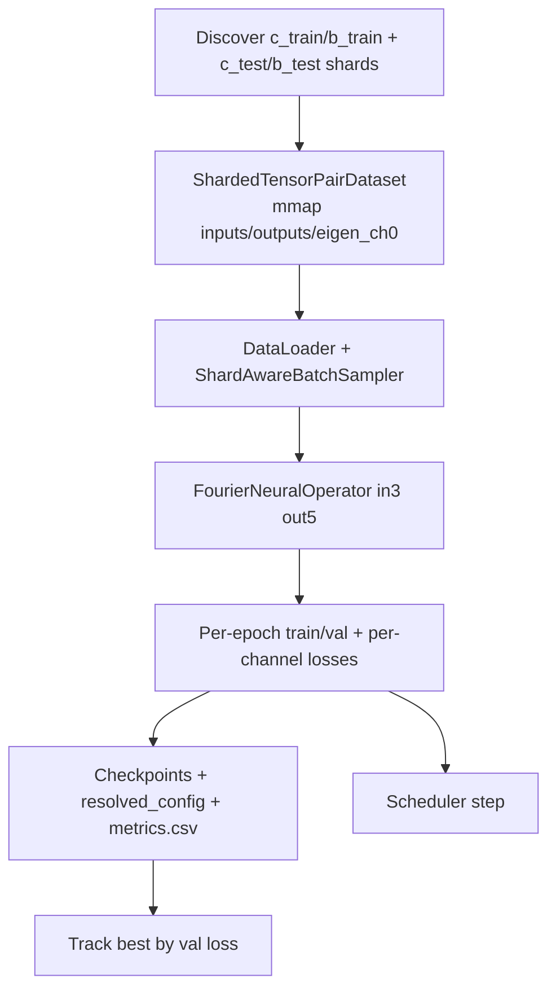

# ML Training

This document describes the neural-operator training workflow. The canonical trainer is
[`train_from_disk.py`](train_from_disk.py); [`train_disk_mlflow.py`](train_disk_mlflow.py)
is the MLflow-integrated variant. Other task-specific variants are summarized briefly.

For how the input data is produced, see [DATA_GENERATION.md](DATA_GENERATION.md).

---

## 1) Data prep (prerequisite)

Training reads per-dataset tensor bundles produced by the generation chain. Two data-prep
scripts (documented in full in [DATA_GENERATION.md](DATA_GENERATION.md)) matter here:

- `build_inputs_outputs_from_reduced_indices.py` — builds `inputs.pt` `(n,3,32,32)` and stacked `outputs_w_{uniform,fft}.pt` `(n,5,32,32)`.
- `rename_and_downselect_indices.py` — renames original indices to `indices_full.pt` and writes a downselected `reduced_indices.pt`, which sets the effective sample count `n` per dataset.

Datasets are discovered under `--output-root` (default `DATASETS/`) by prefix:
- **Train:** `c_train_*`, `b_train_*`
- **Test:** `c_test`, `b_test`

Each dataset's latest `*_pt` folder must contain `inputs.pt`, `outputs.pt`,
`reduced_indices.pt`, and the selected `eigenfrequency_{uniform,fft}_full.pt`.

---

## 2) Main trainer: `train_from_disk.py`

Disk-backed I3O5 training (3 input channels → 5 output channels), streaming shards from
disk so memory stays bounded.

### 2.1 Model contract

- **Input:** `(B, 3, 32, 32)` — geometry, wavevector embedding, band embedding.
- **Output:** `(B, 5, 32, 32)` — `OUT_CHANNELS = 5`: ch0 eigenfrequency, ch1–4 displacements (x_real, x_imag, y_real, y_imag).
- **Model:** `FourierNeuralOperator` (FNO2d) with `in_channels=3`, `out_channels=5`, configurable `hidden_channels`, `n_layers`, `n_modes_height/width`.

### 2.2 On-the-fly target assembly

`ShardedTensorPairDataset` builds each target sample as:
- ch0 from `eigenfrequency_*_full.pt[d, w, b]` (indexed via the `(design, wavevector, band)` triplet in `reduced_indices.pt`),
- ch1–4 from `outputs.pt[local_idx, 1:5]`.

So the trainer does **not** depend on `outputs_w_*.pt`; it stacks channel 0 at load time.
Shards are memory-mapped (`mmap=True`) and loaded one at a time; `ShardAwareBatchSampler`
keeps each batch shard-local to preserve I/O locality.

### 2.3 Key CLI arguments (defaults)

| Argument | Default | Meaning |
|----------|---------|---------|
| `--output-root` | `DATASETS/` | Root containing dataset folders. |
| `--save-dir` | `MODELS/training_runs` | Where run folders/checkpoints are written. |
| `--eigen-ch0-encoding` | (uniform/fft) | Which eigenfrequency tensor fills output ch0. |
| `--epochs` | 12 | Training epochs. |
| `--batch-size` | 520 | Samples per batch. |
| `--num-workers` / `--prefetch-factor` | 2 / 3 | DataLoader streaming knobs. |
| `--hidden-channels` | 128 | FNO width. |
| `--layers` | 4 | FNO layers. |
| `--modes-height` / `--modes-width` | 32 / 32 | Fourier modes. |
| `--learning-rate` | 2e-3 | Adam/optimizer LR. |
| `--weight-decay` | 0.0 | Weight decay. |
| `--loss` | `l1` | One of `mse`, `l1`, `smoothl1`. |
| `--scheduler` | `steplr` | `steplr`, `cosine`, or `none`. |
| `--step-size` / `--gamma` | 1 / 0.9 | StepLR schedule. |
| `--amp` | `none` | Mixed precision: `none`, `fp16`, `bf16`. |
| `--seed` | 0 | RNG seed. |

### 2.4 Training flow



### 2.5 Outputs per run

Written under `MODELS/training_runs/<run_name>/`:

- Epoch checkpoints `<run_name>_E{epoch}.pth`, `<run_name>_best.pth`, `<run_name>_final.pth`.
- `resolved_config.json` (model + hyperparameters; consumed by evaluation tooling).
- `metrics.csv` with `train_loss`, `val_loss`, current `lr`, and per-channel `*_loss_ch0..ch4`.
- Diagnostic panels (via `diagnostic_panels.py`).

### 2.6 Run naming

`build_run_name` produces, e.g.:

```
NO_I3O5_BCF16_{L1|L2|SL1}_HC{hidden}_LR{lr}_WD{wd}_SS{step}_G{gamma}_{ch0u|ch0fft}_{YYMMDD}
```

where `I3O5` = 3-in/5-out, `BCF16` = binarized+continuous designs at float16, and the loss/
hyperparameter/encoding tags follow.

---

## 3) MLflow variant: `train_disk_mlflow.py`

Same dataset/model contract and `EIGEN_CH0_FILES` mapping as `train_from_disk.py`, with
MLflow experiment tracking layered on top (params, per-epoch metrics, and checkpoint
artifacts logged to an MLflow run). Use this when you want centralized experiment
comparison; use `train_from_disk.py` for a lighter local run.

---

## 4) Task-specific variants

| Script | Contract | Targets |
|--------|----------|---------|
| `train_from_disk.py` | **I3O5** (main) | eigenfrequency + 4 displacements |
| `train_from_disk_eigenfrequency.py` | I3O1 | single eigenfrequency channel from `eigenfrequency_*_full.pt` |
| `train_from_disk_displacement.py` | I3O4 | displacement channels 1–4 of `outputs.pt` |
| `train_from_disk_lambda_weighted.py` | I3O5 | I3O5 with lambda/loss-weighted objective |

All variants share the same disk-backed streaming flow as `train_from_disk.py`; they differ
in output-channel count and target sources. Defaults (batch size, DataLoader settings) are
aligned with the main trainer unless noted in each script's header.
