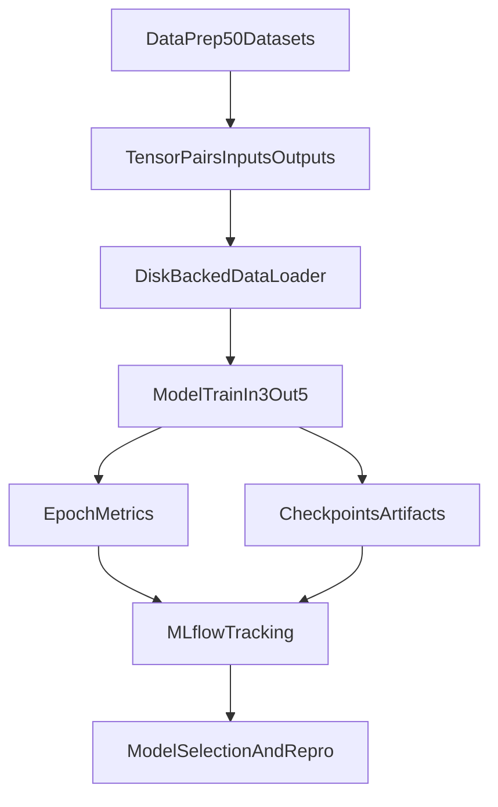

# ML Training Workflow

## Purpose

This document defines the standard training workflow for the NO-2D-Metamaterials project using the current compiled tensor datasets and an updated model I/O contract.

It is the single source of truth for:
- Dataset structure and channel definitions.
- Required model input/output shapes.
- Disk-backed (hard drive) training setup.
- MLflow experiment tracking standards.

---

## 1) Dataset Definition (Current Ground Truth)

### 1.1 Dataset inventory

Training and evaluation data are organized as 50 dataset folders under `OUTPUT`:
- Train: 48 datasets (`c_train_*`, `b_train_*`)
- Test: 2 datasets (`c_test`, `b_test`)

Each dataset has a latest `*_pt` folder containing tensors and metadata.

### 1.2 Required tensors per dataset

For each dataset `.../<dataset_name>/<latest_pt_dir>/`:
- `inputs.pt`: `N x 3 x 32 x 32`
- `outputs.pt`: `N x 5 x 32 x 32`
- `reduced_indices.pt`: list/array of `(design_idx, wavevector_idx, band_idx)` tuples

`N` is dataset-specific and must never be hardcoded. In the current reduced setup, each dataset uses `N = 390000`.

### 1.3 Channel semantics

`inputs.pt` channels:
1. geometry image (`geometries_full[design_idx]`)
2. wavevector image (`waveforms_full[wavevector_idx]`)
3. band image (`band_fft_full[band_idx]`)

`outputs.pt` channels:
1. encoded eigenfrequency image (`eigenfrequency_fft_full[design_idx, wavevector_idx, band_idx]`)
2. displacement channel 1 (`displacements_dataset.pt` tensor index 0)
3. displacement channel 2 (`displacements_dataset.pt` tensor index 1)
4. displacement channel 3 (`displacements_dataset.pt` tensor index 2)
5. displacement channel 4 (`displacements_dataset.pt` tensor index 3)

`outputs.pt` was constructed by stacking the encoded eigenfrequency channel with the four displacement channels sourced from `displacements_dataset.pt`.

### 1.4 Consistency checks before training

Before each training run:
- Confirm all 50 datasets have both `inputs.pt` and `outputs.pt`.
- Confirm sample-count agreement: `inputs.shape[0] == outputs.shape[0]` (only `N` must match).
- Confirm full-shape expectations:
  - input: `N x 3 x 32 x 32`
  - output: `N x 5 x 32 x 32`
- Confirm fixed spatial shape: `32 x 32`.
- Confirm expected channel counts: input channels `3`, output channels `5`.
- Verify dtype policy (recommended: `float16` storage, cast to runtime dtype in loader).

---

## 2) Model Contract

## 2.1 Required model interface

All active training models must satisfy:
- `in_channels = 3`
- `out_channels = 5`
- Spatial domain/output: `32 x 32`

### 2.2 Checkpoint and configuration policy

- Name checkpoints with explicit I/O contract and core hyperparameters.
- Checkpoint naming convention:
  - epoch checkpoints: `<model_run_name>_E{epoch}.pth`
  - final checkpoint: `<model_run_name>_final.pth`
  - optional best checkpoint: `<model_run_name>_best.pth`
- Store full run configuration as an artifact with every checkpoint.
- Always record the exact dataset version and split seed used to produce the run.

---

## 3) Training Pipeline Workflow

### 3.1 Recommended sequence

1. Discover dataset directories and latest `*_pt` paths.
2. Build train/test dataset lists explicitly:
   - Train: all `c_train_*`, `b_train_*`
   - Test: `c_test`, `b_test`
3. Build a shard index map only (metadata in RAM, tensors on disk):
   - For each dataset shard, read shape metadata and `N`.
   - Build cumulative index offsets to map `global_idx -> (shard_id, local_idx)`.
   - Do not concatenate or preload all shards into RAM.
4. Initialize disk-backed dataset/dataloader using per-shard `inputs.pt` and `outputs.pt`.
5. Build model with `in_channels=3`, `out_channels=5`.
6. Start MLflow run and log config immediately.
7. Train per epoch:
   - train pass
   - validation pass
   - checkpoint save
   - MLflow metric/artifact logging
8. Select best checkpoint by documented criterion.
9. Run final test evaluation and log final artifacts.

### 3.2 Reproducibility controls

Set and log:
- Python/NumPy/Torch seeds
- Data split seed
- Dataloader worker seed strategy
- `cudnn` determinism/benchmark flags (and tradeoff if disabled for speed)

---

## 4) Disk-Backed Training (Hard Drive Instead of Full RAM)

## 4.1 Why disk-backed

Full data volume is much larger than practical free RAM. Hard-drive/SSD streaming keeps memory bounded while training on the entire corpus.

### 4.2 Data loading architecture

Use a custom `torch.utils.data.Dataset` (or `IterableDataset` if needed) that:
- Opens dataset shard files (`inputs.pt`, `outputs.pt`) from disk.
- Maps global index to `(dataset_shard, local_index)`.
- Loads only batch-needed slices.

Use `DataLoader` to batch and prefetch from disk in parallel workers.

### 4.3 Baseline loader settings

Starting point for this hardware profile:
- `batch_size=260`
- `num_workers=16`
- `pin_memory=True`
- `persistent_workers=True`
- `prefetch_factor=3`
- `shuffle=True` for train, `False` for eval
- `non_blocking=True` on host->GPU transfer

### 4.4 Tuning order

Tune in this order:
1. `batch_size`
2. `num_workers`
3. `prefetch_factor`
4. storage layout/access pattern

Track:
- samples/sec
- data time vs compute time
- GPU utilization
- host RAM and disk throughput

### 4.5 Throughput bottlenecks and mitigations

- I/O-bound:
  - prefer sequential shard reads over highly random tiny reads
  - keep data on SSD, avoid network-latency storage
- CPU-bound:
  - minimize Python loop work in `__getitem__`
  - vectorize transforms where possible
- transfer-bound:
  - pin memory, use non-blocking copies
  - overlap loading and compute via prefetch/workers

### 4.6 Inputs needed to choose strong defaults up front

To set `batch_size`, `num_workers`, and `prefetch_factor` with minimal trial-and-error, collect:
- GPU details:
  - exact model and available VRAM
  - mixed precision policy (`fp16`/`bf16`)
- Disk performance:
  - storage type and sustained read throughput (MB/s)
  - whether data is on local SSD vs network drive
- CPU constraints:
  - physical/logical core count
  - other concurrent CPU-heavy workloads
- Data access profile:
  - average per-sample read time from `inputs.pt`/`outputs.pt`
  - whether loading is mostly sequential or random
- Baseline microbenchmark:
  - 200-500 train steps measuring `data_time`, `step_time`, GPU utilization, and peak memory

Practical rule:
- Increase `batch_size` until near VRAM limit with safe headroom.
- Set `num_workers` to keep GPU fed (starting at 16 here).
- Raise `prefetch_factor` only if `data_time` still dominates and RAM allows it.

---

## 5) MLflow Standard (Open-Source Experiment Tracking)

MLflow is open-source and should be the default tracking layer for all training variants.

## 5.1 Minimal setup

Install:
- `pip install mlflow`

Start local tracking UI:
- `mlflow ui --port 5000`

Optional explicit tracking URI for local file backend:
- `mlflow.set_tracking_uri("file:./mlruns")`

### 5.2 Run-level fields (log once per run)

Log as params/tags:
- model:
  - architecture name (e.g., `FNO2d`)
  - `in_channels`, `out_channels`, hidden width, layers, modes
- optimization:
  - optimizer type
  - learning rate
  - weight decay
  - scheduler type and arguments
- data:
  - train dataset list
  - test dataset list
  - split seed
  - channel contract version (`in3_out5_v1`)
- environment/provenance:
  - git commit hash
  - dirty/clean worktree flag
  - python/torch/cuda versions
  - GPU model

### 5.3 Epoch-level metrics (log each epoch)

Required:
- `train_loss`
- `val_loss`
- current `lr`
- `epoch_time_sec`
- `train_samples_per_sec`

Recommended:
- per-channel validation metrics:
  - `val_loss_ch0`..`val_loss_ch4`
- `data_time_sec` vs `compute_time_sec` if available
- peak GPU memory (`max_memory_allocated_mb`) if available

### 5.4 Artifacts per run

Log artifacts:
- full resolved config file (`yaml` or `json`)
- best checkpoint (`<model_run_name>_best.pth`)
- final checkpoint (`<model_run_name>_final.pth`)
- epoch checkpoints (`<model_run_name>_E{epoch}.pth`)
- loss curves plot
- per-channel evaluation summary (`json` or `csv`)
- optional inference sample panels

### 5.5 Run naming and tags

Run name pattern:
- `NO_I3O5_BCF16_L2_HC{hidden_channels}_LR{learning_rate}_WD{weight_decay}_SS{step_size}_G{gamma}_{datestampYYMMDD}`

Field meanings:
- `I3O5`: 3 input channels, 5 output channels
- `BCF16`: trained on binarized + continuous geometries, float16 tensor precision
- `L2`: L2/MSE criterion

Core tags:
- `project=NO-2D-Metamaterials`
- `task=surrogate_training`
- `contract=in3_out5`
- `dataset_version=<hash_or_date>`

---

## 6) Experiment Comparison and Model Selection Policy

### 6.1 Primary selection criterion

Use lowest validation loss under the same split and contract version.

### 6.2 Tie-breakers

1. better per-channel balance (no severe failure on `ch0` or any displacement channel)
2. higher throughput at similar quality
3. lower variance across seeds

### 6.3 Promotion rule

A model is promoted only if:
- it beats baseline on primary metric,
- has complete MLflow artifacts,
- is reproducible from saved config + checkpoint.

---

## 7) Operational Notes for This Repository

- Older notebook pipelines that index-build in Python loops are useful for prototyping, but for production-scale runs prefer direct `inputs.pt`/`outputs.pt` streaming.
- Keep document and code contract synchronized: if channel semantics change, bump contract version and update this file.
