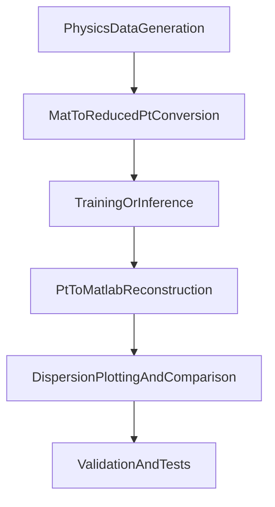

# Project Workflow

This document describes the current end-to-end workflow of the repository at **phase + key scripts + artifacts** level.

It is intended as a first operational map: where data starts, which scripts transform it, and what files are generated at each handoff.

## 1) Big-Picture Flow

## 2) Phase-by-Phase Workflow

### Phase A: Physics data generation (MATLAB/Python FEM pipeline)

- Purpose: generate metamaterial designs, wavevectors, eigenvalues/eigenvectors, and optionally K/M/T matrices.
- Key files:
  - `generate_dispersion_dataset_Han_Alex.py` - Python dataset generator that calls `dispersion_with_matrix_save_opt` and writes MATLAB-compatible output.
  - `2D-dispersion-han/generate_dispersion_dataset_Han.m` - MATLAB dataset generation path.
  - `2D-dispersion-han/ex_dispersion_batch_save.m` - MATLAB batch export flow.
  - `2d-dispersion-py/dispersion_with_matrix_save_opt.py` - low-level dispersion + matrix save core routine used by generation scripts.
- Typical outputs:
  - `.mat` dataset files
  - `.pkl` snapshots (Python-side convenience in selected flows)
  - timestamped output folders (for example under `OUTPUT/output_<timestamp>/`)

### Phase B: MATLAB dataset to reduced PyTorch dataset

- Purpose: convert `.mat` datasets into reduced/embedded `.pt` datasets for NO/FNO workflows.
- Key files:
  - `matlab_to_reduced_pt.py` - main CLI for batch `.mat -> reduced .pt` conversion.
  - `2d-dispersion-py/convert_mat_to_pytorch.py` - conversion path used by Python package workflow.
  - `matlab_to_reduced_pt.ipynb` - notebook version of conversion workflow.
  - `convert_matlab_datasets.ipynb` and `dataset_conversion_reduction.ipynb` - batch conversion/reduction experimentation notebooks.
- Typical outputs (per converted dataset folder):
  - `displacements_dataset.pt`
  - `reduced_indices.pt`
  - `geometries_full.pt`
  - `waveforms_full.pt`
  - `wavevectors_full.pt`
  - `band_fft_full.pt`
  - `design_params_full.pt`

### Phase C: model training and inference

- Purpose: train neural operators or run inference on reduced datasets.
- Key files:
  - `NO_trainer.ipynb` (and related trainer notebooks) - model training workflows.
  - `run_model_inference.py` - main inference CLI that loads model + dataset(s), predicts displacements, saves prediction `.pt`.
- Typical outputs:
  - `.pth` model checkpoints
  - training logs (`.csv`) and experiment arrays (`.npy`) in notebook-controlled output folders
  - inference predictions, usually `predictions_<model_name>.pt` in dataset directory (or custom `--output_path`)

### Phase D: reduced PyTorch prediction/data back to MATLAB format

- Purpose: reconstruct MATLAB-style fields (`EIGENVECTOR_DATA`, `EIGENVALUE_DATA`) from reduced PyTorch tensors.
- Key files:
  - `reduced_pt_to_matlab.py` - main CLI for `.pt -> .mat`, including frequency reconstruction from K/M/T + eigenvectors.
  - `reduced_pt_to_matlab.ipynb` - notebook version of reconstruction flow.
  - `tensor_to_eigenvector_mat.py` - helper conversion workflow.
- Typical outputs:
  - reconstructed `.mat` file(s) (including prediction-backed variants like `*_predictions.mat`)

### Phase E: dispersion plotting and MATLAB/Python comparison

- Purpose: generate design/contour/dispersion plots and compare original vs reconstructed vs MATLAB references.
- Key files:
  - `2d-dispersion-py/plot_dispersion_infer_eigenfrequencies.py` - infer frequencies from eigenvectors and plot; can cache K/M/T.
  - `2d-dispersion-py/plot_dispersion_with_eigenfrequencies.py` - unified plotting across `.mat`, `.pt`, `.npy` inputs.
  - `compare_dispersion_plots.py` - MATLAB/Python comparison script, overlay and difference plots + JSON summary.
  - `2D-dispersion-han/plot_dispersion.m` and `2D-dispersion-han/plot_dispersion_from_predictions.m` - MATLAB plotting side.
- Typical outputs:
  - plot directories under `PLOTS/` (or timestamped plot folders)
  - `.png` files for design/contour/dispersion/reconstruction/difference/overlay
  - `plot_points.npz` and/or `plot_points.mat`
  - summary `.json` files (for selected comparison scripts)

### Phase F: validation and regression checks

- Purpose: verify matrix assembly, numerical consistency, and plotting equivalence.
- Key files:
  - `2d-dispersion-py/tests/run_tests.py` - runs numerical pytest suites and plotting tests.
  - `2d-dispersion-py/tests/` - unit and regression tests.
  - `compare_KMT_python_matlab.py` and related comparison scripts - K/M/T parity checks.
- Typical outputs:
  - pytest terminal results
  - generated test plots/directories from plotting tests

## 3) Artifact Map (filetype -> producer -> location)

| Filetype / Artifact | Main producer scripts | Typical output location |
|---|---|---|
| `.mat` datasets | `generate_dispersion_dataset_Han_Alex.py`, MATLAB generation scripts in `2D-dispersion-han/`, `reduced_pt_to_matlab.py` | `OUTPUT/output_<timestamp>/`, user-specified output paths |
| `.pkl` dataset snapshots | `generate_dispersion_dataset_Han_Alex.py` | `OUTPUT/output_<timestamp>/` |
| Reduced dataset `.pt` bundle | `matlab_to_reduced_pt.py`, `2d-dispersion-py/convert_mat_to_pytorch.py` | `<output_base>/<mat_file_stem>/` |
| Prediction `.pt` | `run_model_inference.py` | usually `<input_dataset_dir>/predictions_<model>.pt` |
| Optional matrix cache `.pt` (`K_data.pt`, `M_data.pt`, `T_data.pt`) | `plot_dispersion_infer_eigenfrequencies.py` | input dataset directory |
| Dispersion and design plot `.png` | plotting scripts in `2d-dispersion-py/` and `2D-dispersion-han/`; `compare_dispersion_plots.py` | `PLOTS/<dataset>_*`, `dispersion_plots_<timestamp>_*`, `dispersion_comparison_<timestamp>/` |
| Plot point bundles (`plot_points.npz`, `plot_points.mat`) | `plot_dispersion_infer_eigenfrequencies.py`, `plot_dispersion_with_eigenfrequencies.py`, MATLAB plotting scripts | plot output directories |
| Comparison/report `.json` | `compare_dispersion_plots.py`, `add_noise_to_pt_dataset.py` | comparison/noise output directories |
| Training logs (`.csv`) and arrays (`.npy`) | training notebooks (`NO_trainer*.ipynb`) | notebook-defined run directories |
| Model checkpoints (`.pth`) | training notebooks (`NO_trainer*.ipynb`) | notebook-defined run directories |

## 4) Common Execution Paths

### Path A: Full ML pipeline (most common)

1. Generate source data (`.mat`) from physics workflow.
2. Convert `.mat -> reduced .pt`.
3. Train model and/or run inference to produce predictions `.pt`.
4. Reconstruct `.mat` from reduced/predicted `.pt`.
5. Plot dispersion and compare with baseline/original.

### Path B: Visualization-only / diagnostics

1. Start from an existing `.mat`, `.pt`, or `.npy` dataset.
2. Run plotting scripts directly.
3. Save figures + contour point files for analysis.

## 5) Notes, Branches, and Assumptions

- The repo contains both CLI and notebook-centric workflows; notebooks are heavily used for training/experiments.
- Some comparison/debug scripts appear exploratory or historical; this map prioritizes active driver scripts and canonical docs.
- Multiple output naming conventions coexist (timestamped experiment folders, `PLOTS/`, per-dataset subfolders).
- K/M/T may be precomputed and reused in some plotting/reconstruction flows, or recomputed on demand.

