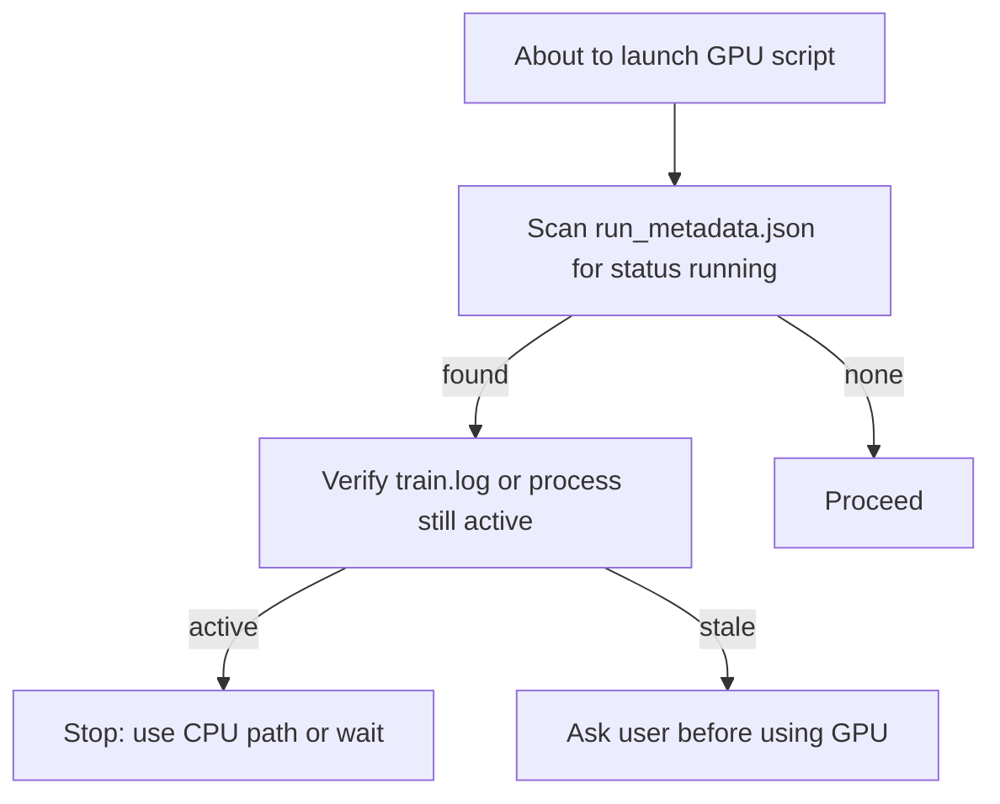

# Project Rules

Conventions for researchers and Cursor agents working in this repo.

**Related docs:** [ML_TRAINING.md](ML_TRAINING.md) · [DATA_GENERATION.md](DATA_GENERATION.md) · [.cursor/rules/](.cursor/rules/)

---

## 1. Style guide and scripting

### Python style and linting

Match patterns already used in trainers and tooling (`train_from_disk.py`, `model_inference_common.py`, etc.):

- Use `from __future__ import annotations` and type hints on public functions.
- Prefer `pathlib.Path` over string paths; use `argparse` for CLI entry points.
- Follow PEP 8 naming; use descriptive names for model/data components (`ShardInfo`, `build_run_name`, …).
- **Preallocate** lists, NumPy arrays, and Torch tensors in hot loops — do not grow collections with `.append()` inside tight loops ([`.cursor/rules/preallocate-lists.mdc`](.cursor/rules/preallocate-lists.mdc)).
- Use PyTorch as the primary DL framework; load disk tensors with `mmap=True` where the repo already does.
- For headless figure export, set `matplotlib.use("Agg")` before importing `pyplot` (see `diagnostic_panels.py`).
- Prefer **minimal diffs**: extend an existing module rather than copying logic into a new file.
- **Commits:** only create git commits when explicitly requested.
- **Do not commit binary artifacts:** `.gitignore` excludes `*.pt`, `*.pth`, `*.npy`, etc.

### When to create a new script

| Situation | Action |
|-----------|--------|
| One-off check that will be discarded | Temporary script — see naming below; delete when done |
| Same logic needed from CLI, pipelines, or agents repeatedly | Add to or wrap an existing canonical script |
| New reusable pipeline step (eval, backfill, inference variant) | New root-level `.py` with `argparse`, docstring, and imports from shared modules |
| Exploratory analysis | Notebook or `*sandbox*` notebook — not a production script |
| Superseded workflow | Move to [`OBSOLETE/`](OBSOLETE/); do not extend for new work |

**Do not** add parallel copies of trainers or inference drivers at repo root. Canonical entry points are documented in [ML_TRAINING.md](ML_TRAINING.md).

**Do not assume scripts exist** because they appear in old logs (e.g. `run_model_inference_cpu_sharded.py` is referenced in inference logs but is not in the repo).

### Naming temporary, diagnostic, and debug scripts

Label throwaway work clearly so it can be found and cleaned up:

| Prefix / pattern | Purpose | Lifecycle |
|------------------|---------|-----------|
| `_tmp_*` | Quick verification or scratch script at repo root | Delete when the question is answered |
| `_eval_*`, `_debug_*` | One-off eval/debug that must not touch production run artifacts | Delete or promote into a named tool |
| `*_debug.py` | Targeted debugging (historically under `OBSOLETE/`) | **DEBUG ONLY** — delete after debugging |
| `run_*_diagnostics*.py` | Named diagnostic tools (e.g. `run_validation_divergence_diagnostics.py`) | Keep if reused; document what they check |
| `diagnostic_panels.py` + `--diagnostic-panels` | Built-in training-time test-set panels | Prefer this over ad-hoc plotting during training |

Exploratory notebooks use `*sandbox*` in the filename (`encoding_sandbox.ipynb`, `NO_sandbox.ipynb`). Superseded notebooks use `obsolete` or `_old` in the name (`figures_obsolete.ipynb`, `Data_sandbox_old.ipynb`) or live under `OBSOLETE/`.

---

## 2. Training and inference

This machine has a **single GPU** (`device_count: 1`). There is no lock file or scheduler — coordination is manual. Training state is in `MODELS/training_runs/<run_name>/run_metadata.json` (`"status": "running" | "completed" | "failed"`).

### GPU: do not start CUDA workloads during active training

If any training run is active, **do not start** any script that uses CUDA by default. Wait, use a CPU alternative, or ask the user.

**Detection checklist** (run before launching GPU work):

1. Scan `MODELS/training_runs/*/run_metadata.json` for `"status": "running"`.
2. If found, read that run's `train.log` tail — if epochs are still advancing, treat the GPU as occupied.
3. Optionally corroborate on Windows: live `train_from_disk*.py` process or `nvidia-smi` showing Python on GPU.

**CUDA-default scripts blocked while training:**

| Script | Notes |
|--------|-------|
| `train_from_disk.py` (+ eigen/displacement/lambda_weighted variants) | CUDA unless `--allow-cpu` |
| `train_disk_mlflow.py` | Same |
| `run_model_inference_gpu.py` | GPU inference |
| `evaluate_from_disk.py` | CUDA default; `--allow-cpu` exists |
| `backfill_val_dual_loss.py` | Full-val GPU backfill |
| `run_*.bat` / `.ps1` wrappers invoking the above | Indirect GPU use |

**Allowed while training:** `run_model_inference_cpu.py`, read-only monitoring (`watch_training_vs_baseline.py`, log/metrics inspection), notebooks that do not load models on GPU.

**Stale `"running"` status:** If metadata says running but `train.log` is frozen and no trainer process exists, ask the user before reclaiming the GPU; optionally set status to `"failed"`.

### Training runs

- **One job at a time:** never launch a second trainer while another run has `status: running`.
- **Resume, don't overwrite:** use `--resume-run-dir` + `--extend-epochs`; use `--output-run-dir` only when intentionally copying to a new folder.
- **Output location:** `MODELS/training_runs/<run_name>/` using `build_run_name` ([ML_TRAINING.md §2.6](ML_TRAINING.md)).
- **Windows DataLoader defaults:** `--batch-size 520`, `--num-workers 2`, `--prefetch-factor 3` unless measured otherwise.
- **Environment:** conda env `NO_2D_Metamaterials` (`C:\ProgramData\anaconda3\envs\NO_2D_Metamaterials\python.exe` in existing `.bat` files).
- **Do not edit active run artifacts:** while `status: running`, do not manually modify `metrics.csv`, checkpoints, or `train.log`.

### Inference and evaluation

- **GPU vs CPU:** `run_model_inference_gpu.py` when GPU is free; `run_model_inference_cpu.py` when training holds the GPU.
- **Config fidelity:** load architecture from the run's `resolved_config.json`.
- **Output location:** `INFERENCE/<model_name>_<YYMMDD-HHMMSS>/` with `predictions_{case}_{model_name}.pt` and `inference_info_*.txt` (see `model_inference_common.py`).

### Launch scripts and pipelines

- **Detached long jobs:** use `*_detached.bat` — redirect stdout/stderr to a log under `MODELS/training_runs/`.
- **No duplicate pipelines:** before `run_backfill_fullval_all_runs.bat` or `poll_backfill_then_report_and_train.bat`, check an existing log for `=== ALL DONE ===`.
- **Chained pipelines:** `run_after_backfill_report_and_huber.bat` ends in training — ensure no run is already active.
- **Launcher paths:** root `.bat`/`.ps1` hardcode `D:\Research\NO-2D-Metamaterials`; update if the repo moves.

---

## 3. Notebooks, data, and plot labelling

### Notebooks

| Pattern | Use |
|---------|-----|
| `figures_{continuous\|binary}_I3O5_ef{Uniform\|FFT}.ipynb` | Publication / results figures for a specific model contract |
| `figures_methodology.ipynb` | Methods figures |
| `figures_*obsolete*.ipynb`, `figures_old_*.ipynb` | Superseded — do not extend for current I3O5 work |
| `NO_trainer*.ipynb` | Legacy notebook training — prefer `train_from_disk.py` for new runs |
| `*sandbox*.ipynb` | Exploratory scratch — not source of truth for pipelines |
| `*_tests*.ipynb`, `encoding_sandbox.ipynb` | Encoding / unit-style experiments |

Keep figure notebooks focused: import block, path constants, then analysis cells. Prefer saving outputs to `PLOTS/` rather than scattering PNGs at repo root.

### Data labelling and layout

Follow [DATA_GENERATION.md](DATA_GENERATION.md) for the full chain. Training discovers datasets under `DATASETS/` by prefix:

- **Train:** `c_train_*`, `b_train_*` (continuous / binary)
- **Test:** `c_test`, `b_test`

Each dataset's latest `*_pt` folder must contain `inputs.pt`, `outputs.pt`, `reduced_indices.pt`, and `eigenfrequency_{uniform,fft}_full.pt`.

**Bundle naming:** raw generation writes `OUTPUT/.../<continuous|binarized>_<timestamp>_pt/`; organized training bundles follow the same continuous/binary + timestamp + `_pt` pattern under `DATASETS/`.

**In-place replacements:** when regenerating a tensor in place, rename the old file with an `_old` suffix (e.g. `inputs_old.pt`, `waveforms_full_old.pt`) before writing the new file.

**Do not run** `run_generate_dispersion_batched.py` (16 workers by default) concurrently with active training — it competes for CPU/RAM and slows DataLoader workers.

### Plot and figure output labelling

| Context | Location / pattern | Example |
|---------|-------------------|---------|
| Training diagnostics | `<run_dir>/diagnostics/epoch_<NNN>/` | `epoch_005_sample_03_idx_770607.png` |
| Dataset histograms | Colocated in the `*_pt` folder | `hist_eigenfrequency_uniform_full.png`, `hist_reduced_indices_1x3.png` |
| Exploratory / parameter sweeps | `PLOTS/<study>/<variant>/` | `PLOTS/wavelet_embedding_inspection/...` |
| Inference artifacts | `INFERENCE/<model>_<timestamp>/` | `predictions_I3O5_<run_name>.pt`, `inference_info_*.txt` |
| Downstream analysis CSVs | Beside inference output | `loss_comparison_<dataset>.csv` |

**Figure export defaults in scripts:** `dpi=150–160`, `bbox_inches="tight"` where used (`plot_dataset_histograms.py`, `diagnostic_panels.py`).

**Naming content:** include epoch, sample rank, and dataset index in training diagnostic filenames; include model run name and timestamp in inference folder names so outputs are traceable without opening files.
